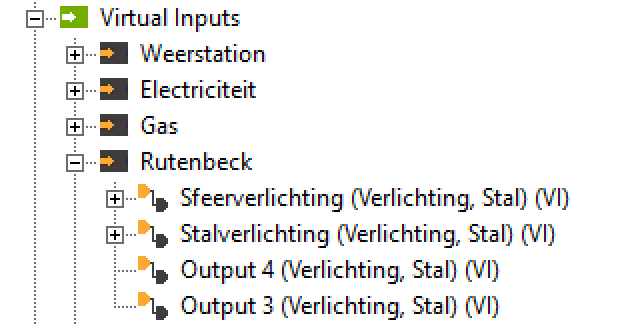
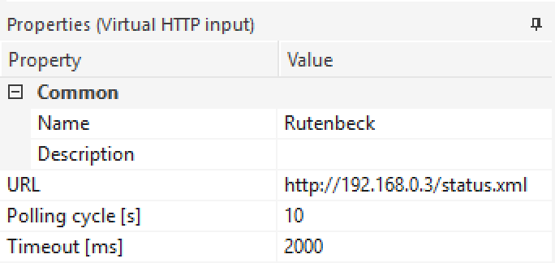
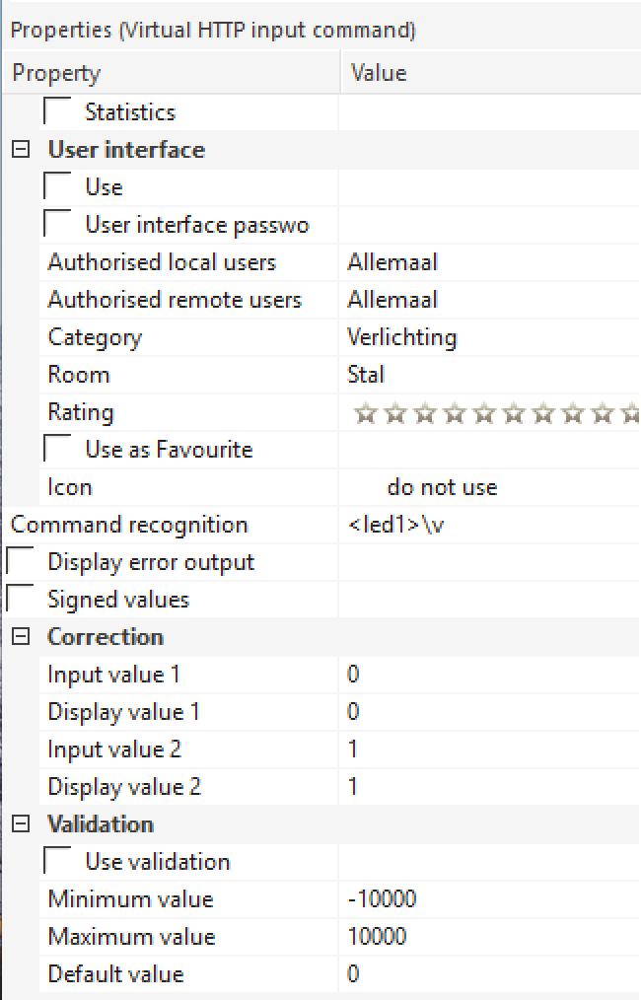
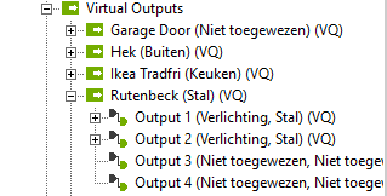
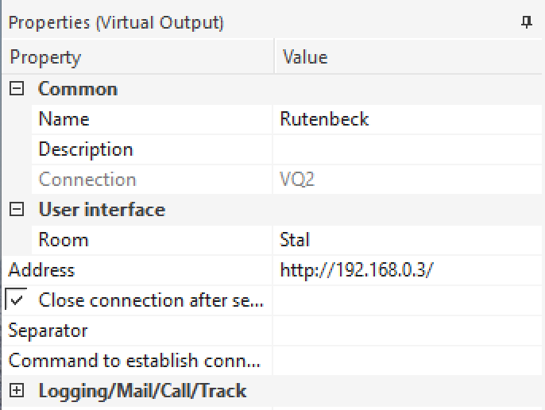
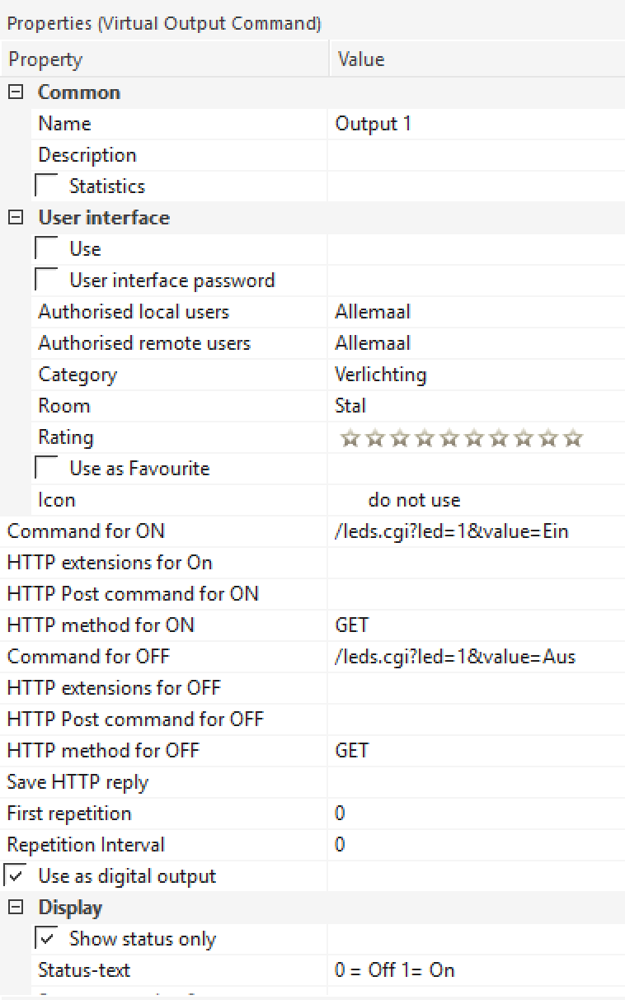
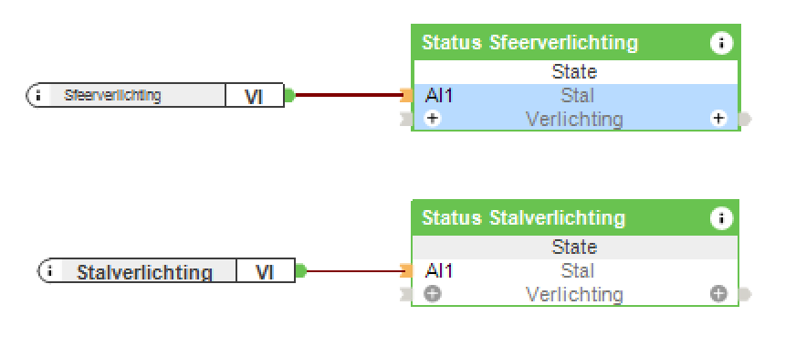

# Loxone Rutenbeck

I needed to switch lights in a barn located 100 yards from the main
house using Loxone.

Additionally I want to be able to have traditional switches for local
control.

The range is too far for Loxone Air, otherwise a Nano Air would have
been ideal. I did install an Ethernet cable to the barn for future
expansion, a security camera, or other needs.

## The Rutenbeck TCRIP4 switch

I found the following switch:

http://www.rutenbeck.de/produkte/c/ip-aktoriksensorik/p/tcr-ip-4.html

Available from Conrad:

(http://www.conrad-electronic.co.uk/ce/en/product/976282/Rutenbeck?ref=searchDetail

This has 4 relays that can be controlled using a web-page, or UDP (which is
not documented very well).

Additionally the status of each relay can be retrieved using http protocol.

The device has four local inputs that can be used to switch the relays
with local switchgear.

It fits on a din rail, needs 230V for operation, and has an input for an
optional temperature sensor.

## Documentation and shortcomings

I have noticed that it is hard to give the TCRIP4 a permanent, new, static
IP address. If you can stick with the default address, 192.168.0.3, this is
preferable. Obviously this does not work if you have more than one of
these devices in your network.

## Controlling via UDP

Initially you need to connect a PC with a static IP address of 192.168.0.1 to
the Rutenbeck using a cross over cable. Only then can you access the web
interface to set a different static address or a DHCP assigned address to the
Rutenbeck. Then you also need to enable UDP operation and the UDP port 30303.
Then it is a simple matter of sending a command using standard Loxone virtual
output: OUT1 1 to switch on relay 1, OUT3 0 to switch off relay 3.

The UDP-command must be send to Port 30303 and end with Hex 0H.

The problem I ran into however, is that like all other settings, the Rutenbeck device
loses those settings, and therefore UDP access, at random times, although frequently
related to power cycling. I therefore looked for a way of controlling the lights without having
to change the Rutenbeck configuration.

## Control via http

By carefully looking at the code of the Rutenbeck, I found that it is possible to control the relays directly.

A request to `http://192.168.0.3/leds.cgi=X&value=Ein` allows led X (where X = 1..4) relay 1 to be switched on.
Changing Ein to Aus switches it off.

## Reading status

I also found a hidden HTTP request that returns the status of the relays (so that you can check if a local switch has enabled a relay). Go to http://192.168.0.3/status.xml
and it returns:

```
<response>  
   <led1>0</led1>  
   <led2>1</led2>  
   <led3>0</led3>  
   <led4>0</led4>  
   <pot0>nicht angeschlossen</pot0>  
</response>
```

## Loxone configuration

First define two virtual devices, one input and one output. Then create the appropriate ports for each of the relays to be used.

### Virtual Input


Virtual Input


Virtual Input Command


Virtual Inpur Status of Led 1

### Virtual Output


Virtual Output


Virtual Output Command


Virtual Output Control of Led 1

### Use in Loxone


Light Status Block


